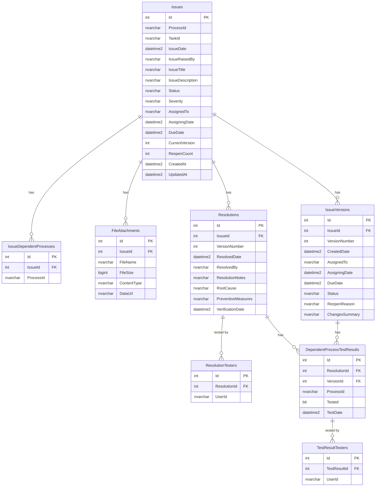
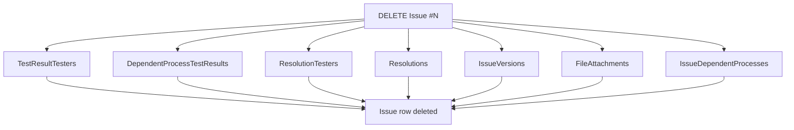

# DMS Issue Tracker

Full-stack issue tracking application for Ali & Sons DMS (Dealer Management System). Built with .NET 10 Minimal API + Dapper backend and React (Vite) + Tailwind CSS + shadcn/ui frontend. All database operations are executed through stored procedures.

---

## Quick Start

> **You MUST start the SQL Server Docker container before running the API.**

### One-command startup (recommended)

From the `backend/` directory:

```bash
# Git Bash / Linux / macOS
./start.sh

# PowerShell
.\start.ps1
```

This script will: start Docker SQL Server, wait until it accepts connections, then launch the API.

### Manual startup

```bash
# 1. Start SQL Server (from backend/ directory)
docker compose up -d

# 2. Verify SQL Server is running
docker ps   # should show "dms-sqlserver" container

# 3. Run the API
dotnet run
```

The API will be available at `http://localhost:4000`. On first startup it auto-creates the database, tables, stored procedures, and seed data.

---

## Table of Contents

- [Architecture Overview](#architecture-overview)
- [Project Structure](#project-structure)
- [Technology Stack](#technology-stack)
- [Database Schema](#database-schema)
- [Stored Procedures](#stored-procedures)
- [API Endpoints](#api-endpoints)
- [Request / Response DTOs](#request--response-dtos)
- [Data Flow](#data-flow)
- [Local Development Setup](#local-development-setup)
- [Configuration](#configuration)
- [Swagger Documentation](#swagger-documentation)

---

## Architecture Overview

```
+-----------+       HTTP/JSON       +------------------+       Stored Procs       +-------------------+
|           |  -------------------> |                  |  --------------------->  |                   |
|  React    |       REST API        |  .NET 10 API     |       Dapper + SP        |  SQL Server 2022  |
|  (Vite)   |  <------------------- |  (Minimal API)   |  <---------------------  |  (Docker)         |
|           |                       |                  |                          |                   |
+-----------+                       +------------------+                          +-------------------+
  Port 3000                           Port 4000                                    Port 1433
                                         |
                                    +---------+
                                    | Swagger |
                                    | /swagger|
                                    +---------+
```

The API follows a clean layered architecture:

```
Endpoints (HTTP routing)
    |
    v
Services (business logic, orchestration)
    |
    v
Repositories (data access via Dapper + stored procedures)
    |
    v
SQL Server (tables + stored procedures)
```

---

## Project Structure

```
backend/
  DMS.API/
    Program.cs                          # Application entry point, DI registration, middleware pipeline
    DMS.API.csproj                      # Project file, package references
    |
    Endpoints/
      IssueEndpoints.cs                 # HTTP route definitions (7 endpoints)
    |
    Services/
      IIssueService.cs                  # Service interface
      IssueService.cs                   # Business logic, orchestrates repository calls
    |
    Repositories/
      IIssueRepository.cs              # Repository interface (17 methods)
      IssueRepository.cs              # Dapper implementation, all calls via CommandType.StoredProcedure
    |
    Models/
      Issue.cs                         # Core issue entity
      IssueVersion.cs                  # Version history entity
      Resolution.cs                    # Resolution details entity
      FileAttachment.cs                # File attachment entity
      DependentProcessTestResult.cs    # Dependent process test result entity
      Dtos.cs                          # Request and response DTOs
    |
    Data/
      DbConnectionFactory.cs           # IDbConnectionFactory interface + SqlServerConnectionFactory
      DbInitializer.cs                 # Schema creation (8 tables) + stored procedure deployment (20 SPs)
      SeedData.cs                      # Sample data seeder (5 issues with full relationships)
    |
    Properties/
      launchSettings.json              # Dev server URL configuration
    |
    appsettings.json                   # Connection string, logging config
    appsettings.Development.json       # Development overrides
```

---

## Technology Stack

| Component       | Technology                                  |
|-----------------|---------------------------------------------|
| Runtime         | .NET 10                                     |
| API Framework   | ASP.NET Core Minimal API                    |
| ORM             | Dapper 2.1.66 (micro-ORM)                  |
| Database        | SQL Server 2022 Express (Docker container)  |
| DB Driver       | Microsoft.Data.SqlClient 6.1.4              |
| API Docs        | Swashbuckle.AspNetCore 10.1.4 (Swagger)    |
| DB Access       | Stored Procedures (all 19 operations)       |

---

## Database Schema

**Database Name:** `DMS_IssueTracker`

### Entity Relationship Diagram

```
+------------------+       1:N       +-------------------------+
|     Issues       | --------------> | IssueDependentProcesses |
|------------------|                 +-------------------------+
| Id (PK)          |
| ProcessId        |       1:N       +------------------+
| TaskId           | --------------> | FileAttachments  |
| IssueDate        |                 +------------------+
| IssueRaisedBy    |
| IssueTitle       |       1:N       +------------------+       1:N       +---------------------------+
| IssueDescription | --------------> | IssueVersions    | - - - - - - -> | DependentProcessTestResults|
| Status           |                 +------------------+                +---------------------------+
| Severity         |
| AssignedTo       |       1:N       +------------------+       1:N       +---------------------+
| AssigningDate    | --------------> | Resolutions      | --------------> | ResolutionTesters   |
| DueDate          |                 +------------------+                 +---------------------+
| CurrentVersion   |                         |
| ReopenCount      |                         | 1:N       +---------------------------+       1:N
| CreatedAt        |                         +---------> | DependentProcessTestResults| ---------->
| UpdatedAt        |                                     +---------------------------+
+------------------+                                              |
                                                                  | 1:N
                                                                  v
                                                         +---------------------+
                                                         | TestResultTesters   |
                                                         +---------------------+
```

### Mermaid ER Diagram



### Cascade Delete Behavior

Deleting an Issue (`sp_DeleteIssue`) cascades through all child tables in this order:



All child rows are explicitly deleted in a transaction before the parent Issue row is removed.

### Foreign Key Summary

| Child Table | FK Column | References | On Delete |
|-------------|-----------|------------|-----------|
| IssueDependentProcesses | IssueId | Issues(Id) | CASCADE |
| FileAttachments | IssueId | Issues(Id) | CASCADE |
| IssueVersions | IssueId | Issues(Id) | CASCADE |
| Resolutions | IssueId | Issues(Id) | CASCADE |
| ResolutionTesters | ResolutionId | Resolutions(Id) | CASCADE |
| DependentProcessTestResults | ResolutionId | Resolutions(Id) | SET NULL |
| DependentProcessTestResults | VersionId | IssueVersions(Id) | SET NULL |
| TestResultTesters | TestResultId | DependentProcessTestResults(Id) | CASCADE |

### Tables (8)

#### Issues (primary table)

| Column           | Type           | Constraints                          |
|------------------|----------------|--------------------------------------|
| Id               | INT            | PRIMARY KEY, IDENTITY(1,1)           |
| ProcessId        | NVARCHAR(100)  | NOT NULL                             |
| TaskId           | NVARCHAR(100)  | NOT NULL                             |
| IssueDate        | DATETIME2      | NOT NULL                             |
| IssueRaisedBy    | NVARCHAR(100)  | NOT NULL                             |
| IssueTitle       | NVARCHAR(500)  | NOT NULL                             |
| IssueDescription | NVARCHAR(MAX)  | NOT NULL, DEFAULT ''                 |
| Status           | NVARCHAR(50)   | NOT NULL, DEFAULT 'New'              |
| Severity         | NVARCHAR(50)   | NOT NULL                             |
| AssignedTo       | NVARCHAR(100)  | NOT NULL                             |
| AssigningDate    | DATETIME2      | NULL                                 |
| DueDate          | DATETIME2      | NULL                                 |
| CurrentVersion   | INT            | NOT NULL, DEFAULT 1                  |
| ReopenCount      | INT            | NOT NULL, DEFAULT 0                  |
| CreatedAt        | DATETIME2      | NOT NULL, DEFAULT SYSUTCDATETIME()   |
| UpdatedAt        | DATETIME2      | NOT NULL, DEFAULT SYSUTCDATETIME()   |

**Status values:** `New`, `In Progress`, `Testing`, `Resolved`, `Closed`, `Reopened`

**Severity values:** `Low`, `Medium`, `High`, `Critical`

#### IssueDependentProcesses

| Column    | Type          | Constraints                                     |
|-----------|---------------|-------------------------------------------------|
| Id        | INT           | PRIMARY KEY, IDENTITY(1,1)                      |
| IssueId   | INT           | NOT NULL, FK -> Issues(Id) ON DELETE CASCADE     |
| ProcessId | NVARCHAR(100) | NOT NULL                                        |

#### FileAttachments

| Column      | Type          | Constraints                                     |
|-------------|---------------|-------------------------------------------------|
| Id          | INT           | PRIMARY KEY, IDENTITY(1,1)                      |
| IssueId     | INT           | NOT NULL, FK -> Issues(Id) ON DELETE CASCADE     |
| FileName    | NVARCHAR(500) | NOT NULL                                        |
| FileSize    | BIGINT        | NOT NULL                                        |
| ContentType | NVARCHAR(200) | NOT NULL                                        |
| DataUrl     | NVARCHAR(MAX) | NOT NULL                                        |

#### IssueVersions

| Column        | Type          | Constraints                                     |
|---------------|---------------|-------------------------------------------------|
| Id            | INT           | PRIMARY KEY, IDENTITY(1,1)                      |
| IssueId       | INT           | NOT NULL, FK -> Issues(Id) ON DELETE CASCADE     |
| VersionNumber | INT           | NOT NULL                                        |
| CreatedDate   | DATETIME2     | NOT NULL, DEFAULT SYSUTCDATETIME()               |
| AssignedTo    | NVARCHAR(100) | NOT NULL                                        |
| AssigningDate | DATETIME2     | NULL                                             |
| DueDate       | DATETIME2     | NULL                                             |
| Status        | NVARCHAR(50)  | NOT NULL                                        |
| ReopenReason    | NVARCHAR(MAX) | NULL                                             |
| ChangesSummary  | NVARCHAR(MAX) | NULL (JSON audit trail of field changes)          |

#### Resolutions

| Column             | Type          | Constraints                                     |
|--------------------|---------------|-------------------------------------------------|
| Id                 | INT           | PRIMARY KEY, IDENTITY(1,1)                      |
| IssueId            | INT           | NOT NULL, FK -> Issues(Id) ON DELETE CASCADE     |
| VersionNumber      | INT           | NOT NULL                                        |
| ResolvedDate       | DATETIME2     | NOT NULL, DEFAULT SYSUTCDATETIME()               |
| ResolvedBy         | NVARCHAR(100) | NOT NULL                                        |
| ResolutionNotes    | NVARCHAR(MAX) | NOT NULL, DEFAULT ''                             |
| RootCause          | NVARCHAR(MAX) | NOT NULL, DEFAULT ''                             |
| PreventiveMeasures | NVARCHAR(MAX) | NOT NULL, DEFAULT ''                             |
| VerificationDate   | DATETIME2     | NULL                                             |

#### ResolutionTesters

| Column       | Type          | Constraints                                          |
|--------------|---------------|------------------------------------------------------|
| Id           | INT           | PRIMARY KEY, IDENTITY(1,1)                           |
| ResolutionId | INT           | NOT NULL, FK -> Resolutions(Id) ON DELETE CASCADE     |
| UserId       | NVARCHAR(100) | NOT NULL                                             |

#### DependentProcessTestResults

| Column       | Type          | Constraints                                          |
|--------------|---------------|------------------------------------------------------|
| Id           | INT           | PRIMARY KEY, IDENTITY(1,1)                           |
| ResolutionId | INT           | NULL, FK -> Resolutions(Id)                          |
| VersionId    | INT           | NULL, FK -> IssueVersions(Id)                        |
| ProcessId    | NVARCHAR(100) | NOT NULL                                             |
| Tested       | BIT           | NOT NULL, DEFAULT 0                                  |
| TestDate     | DATETIME2     | NULL                                                 |

#### TestResultTesters

| Column       | Type          | Constraints                                                       |
|--------------|---------------|-------------------------------------------------------------------|
| Id           | INT           | PRIMARY KEY, IDENTITY(1,1)                                        |
| TestResultId | INT           | NOT NULL, FK -> DependentProcessTestResults(Id) ON DELETE CASCADE   |
| UserId       | NVARCHAR(100) | NOT NULL                                                          |

---

## Stored Procedures

All 20 stored procedures are deployed automatically on application startup via `DbInitializer.cs`. Every database operation in the repository layer uses `CommandType.StoredProcedure`.

### Issue Operations

| Procedure          | Parameters                                                                                       | Returns              |
|--------------------|--------------------------------------------------------------------------------------------------|----------------------|
| sp_GetAllIssues    | (none)                                                                                           | All issues, ordered by CreatedAt DESC |
| sp_GetIssueById    | @Id INT                                                                                          | Single issue row     |
| sp_CreateIssue     | @ProcessId, @TaskId, @IssueDate, @IssueRaisedBy, @IssueTitle, @IssueDescription, @Status, @Severity, @AssignedTo, @AssigningDate, @DueDate, @CurrentVersion, @ReopenCount | New issue ID (INT)   |
| sp_UpdateIssue     | @Id, @IssueTitle, @IssueDescription, @Status, @Severity, @AssignedTo, @AssigningDate, @DueDate, @CurrentVersion, @ReopenCount | (none)               |
| sp_DeleteIssue     | @Id INT                                                                                          | (none) Explicit transactional delete of all child rows |

### Dependent Process Operations

| Procedure                    | Parameters               | Returns          |
|------------------------------|--------------------------|------------------|
| sp_DeleteDependentProcesses  | @IssueId INT             | (none)           |
| sp_AddDependentProcess       | @IssueId, @ProcessId     | (none)           |
| sp_GetDependentProcesses     | @IssueId INT             | List of ProcessId|

### Attachment Operations

| Procedure        | Parameters                                             | Returns             |
|------------------|--------------------------------------------------------|---------------------|
| sp_AddAttachment | @IssueId, @FileName, @FileSize, @ContentType, @DataUrl | (none)             |
| sp_GetAttachments| @IssueId INT                                           | All file attachments|

### Version Operations

| Procedure     | Parameters                                                                            | Returns           |
|---------------|---------------------------------------------------------------------------------------|-------------------|
| sp_AddVersion | @IssueId, @VersionNumber, @AssignedTo, @AssigningDate, @DueDate, @Status, @ReopenReason, @ChangesSummary | New version ID  |
| sp_GetVersions| @IssueId INT                                                                          | Versions ordered by VersionNumber |

### Resolution Operations

| Procedure               | Parameters                                                                                        | Returns            |
|-------------------------|---------------------------------------------------------------------------------------------------|--------------------|
| sp_AddResolution        | @IssueId, @VersionNumber, @ResolvedBy, @ResolutionNotes, @RootCause, @PreventiveMeasures, @VerificationDate | New resolution ID |
| sp_GetLatestResolution  | @IssueId INT                                                                                      | Latest resolution (TOP 1 by VersionNumber DESC) |
| sp_AddResolutionTester  | @ResolutionId, @UserId                                                                            | (none)             |
| sp_GetResolutionTesters | @ResolutionId INT                                                                                 | List of UserId     |
| sp_AddDepTestResult     | @ResolutionId, @VersionId, @ProcessId, @Tested, @TestDate                                         | New test result ID |
| sp_GetDepTestResults    | @ResolutionId INT                                                                                 | Test results for resolution |
| sp_AddTestResultTester  | @TestResultId, @UserId                                                                            | (none)             |
| sp_GetTestResultTesters | @TestResultId INT                                                                                 | List of UserId     |

---

## API Endpoints

Base URL: `http://localhost:4000`

### Issue Endpoints

| Method | Route                      | Operation      | Request Body          | Response                     |
|--------|----------------------------|----------------|-----------------------|------------------------------|
| GET    | /api/issues                | List all       | -                     | 200: IssueListItem[]         |
| GET    | /api/issues/{id}           | Get detail     | -                     | 200: IssueDetailResponse     |
| POST   | /api/issues                | Create         | CreateIssueRequest    | 201: { id: int }             |
| PATCH  | /api/issues/{id}           | Update         | UpdateIssueRequest    | 204: No Content              |
| DELETE | /api/issues/{id}           | Delete         | -                     | 204: No Content              |
| POST   | /api/issues/{id}/delete    | Delete (IIS)   | -                     | 204: No Content              |
| POST   | /api/issues/{id}/resolve   | Resolve        | ResolveIssueRequest   | 200: { message: string }     |
| POST   | /api/issues/{id}/reopen    | Reopen         | ReopenIssueRequest    | 200: { message: string }     |
| POST   | /api/issues/bulk           | CSV Import     | multipart/form-data   | 200: { created, errors }     |

### Auth Endpoints

| Method | Route                      | Operation      | Request Body          | Response                     |
|--------|----------------------------|----------------|-----------------------|------------------------------|
| POST   | /api/auth/verify-token     | EDP SSO verify | { token }             | 200: { user, sessionToken }  |

### Admin Endpoints

| Method | Route                              | Operation           | Request Body          | Response                     |
|--------|-------------------------------------|---------------------|-----------------------|------------------------------|
| POST   | /api/admin/login                   | Admin login         | { username, password }| 200: { token, username }     |
| GET    | /api/admin/dashboard-stats         | Dashboard stats     | -                     | 200: AdminDashboardStats     |
| GET    | /api/admin/statuses                | List statuses       | -                     | 200: AdminStatus[]           |
| POST   | /api/admin/statuses                | Create status       | { name, chartColor }  | 201: { id }                  |
| POST   | /api/admin/statuses/{id}/update    | Update status       | { name, chartColor }  | 204                          |
| DELETE | /api/admin/statuses/{id}           | Delete status       | -                     | 204                          |
| GET    | /api/admin/severities              | List severities     | -                     | 200: AdminSeverity[]         |
| POST   | /api/admin/severities              | Create severity     | { name }              | 201: { id }                  |
| POST   | /api/admin/severities/{id}/update  | Update severity     | { name }              | 204                          |
| DELETE | /api/admin/severities/{id}         | Delete severity     | -                     | 204                          |
| GET    | /api/admin/processes               | List processes      | -                     | 200: AdminProcess[]          |
| POST   | /api/admin/processes               | Create process      | { name }              | 200                          |
| POST   | /api/admin/processes/{id}/update   | Update process      | { name }              | 204                          |
| DELETE | /api/admin/processes/{id}          | Delete process      | -                     | 204                          |
| GET    | /api/admin/tasks                   | List tasks          | -                     | 200: AdminTask[]             |
| POST   | /api/admin/tasks                   | Create task         | { name, processId }   | 201: { id }                  |
| POST   | /api/admin/tasks/{id}/update       | Update task         | { name, processId }   | 204                          |
| DELETE | /api/admin/tasks/{id}              | Delete task         | -                     | 204                          |
| GET    | /api/admin/users                   | List users          | -                     | 200: AdminUser[]             |
| POST   | /api/admin/users                   | Create user         | { id, name, email }   | 200                          |
| POST   | /api/admin/users/{id}/update       | Update user         | { name, email, ... }  | 204                          |
| DELETE | /api/admin/users/{id}              | Delete user         | -                     | 204                          |
| GET    | /api/admin/permissions             | List permissions    | -                     | 200: UserPermission[]        |
| GET    | /api/admin/permissions/{userId}    | Get user permission | -                     | 200: UserPermission          |
| POST   | /api/admin/permissions/{userId}/update | Update permission | { canCreate, ... } | 204                          |
| POST   | /api/admin/enter-app               | Login as user       | { userId }            | 200: { user, sessionToken }  |
| GET    | /api/admin/employees/search        | Search EDP employees| ?q=query              | 200: Employee[]              |
| POST   | /api/admin/employees/add           | Add EDP employee    | { empId }             | 200                          |

### Master Data Endpoints

| Method | Route              | Operation      | Response                     |
|--------|--------------------|----------------|------------------------------|
| GET    | /api/master        | Get all master | 200: { statuses, severities, processes, tasks, users } |

All endpoints return `404 Not Found` when the resource does not exist. Issue endpoints require a valid `X-Session-Token` header. Admin endpoints require a valid `X-Admin-Token` header (except login).

---

## Request / Response DTOs

### CreateIssueRequest

```json
{
  "processId": "p1",
  "taskId": "t1",
  "issueDate": "2026-02-01T00:00:00",
  "issueRaisedBy": "u6",
  "issueTitle": "CRM Lead Conversion Failing",
  "issueDescription": "Description of the issue...",
  "severity": "High",
  "assignedTo": "u1",
  "assigningDate": "2026-02-01T00:00:00",
  "dueDate": "2026-02-10T00:00:00",
  "dependentProcesses": ["p4"],
  "attachments": [
    {
      "fileName": "screenshot.png",
      "fileSize": 204800,
      "contentType": "image/png",
      "dataUrl": "data:image/png;base64,..."
    }
  ]
}
```

### UpdateIssueRequest (PATCH - all fields optional)

```json
{
  "issueTitle": "Updated Title",
  "issueDescription": "Updated description text",
  "status": "In Progress",
  "assignedTo": "u2",
  "assigningDate": "2026-02-05T00:00:00",
  "dueDate": "2026-02-15T00:00:00",
  "severity": "Critical"
}
```

### ResolveIssueRequest

```json
{
  "resolvedBy": "u4",
  "resolutionNotes": "Fixed the issue by updating the PDF library.",
  "rootCause": "ASCII encoding instead of UTF-8.",
  "preventiveMeasures": "Added unit tests for special characters.",
  "testedBy": ["u6", "u7"],
  "verificationDate": "2026-01-29T00:00:00",
  "dependentProcessesTestResults": [
    {
      "processId": "p4",
      "tested": true,
      "testedBy": ["u5"],
      "testDate": "2026-01-29T00:00:00"
    }
  ]
}
```

### ReopenIssueRequest

```json
{
  "reopenReason": "Issue reoccurred after the fix.",
  "assignedTo": "u1",
  "dueDate": "2026-03-01T00:00:00"
}
```

### IssueListItem (GET /api/issues response item)

```json
{
  "id": 1,
  "processId": "p1",
  "taskId": "t1",
  "issueTitle": "CRM Lead Conversion Failing",
  "status": "In Progress",
  "severity": "High",
  "assignedTo": "u1",
  "issueRaisedBy": "u6",
  "issueDate": "2026-02-01T00:00:00",
  "dueDate": "2026-02-10T00:00:00",
  "currentVersion": 1,
  "reopenCount": 0,
  "createdAt": "2026-02-01T09:00:00",
  "updatedAt": "2026-02-05T14:30:00"
}
```

### IssueDetailResponse (GET /api/issues/{id} response)

```json
{
  "id": 5,
  "processId": "p1",
  "taskId": "t3",
  "issueDate": "2026-01-20T00:00:00",
  "issueRaisedBy": "u7",
  "issueTitle": "F&I Contract PDF Generation Error",
  "issueDescription": "Finance and Insurance contracts fail to generate PDF...",
  "status": "Resolved",
  "severity": "High",
  "assignedTo": "u4",
  "assigningDate": "2026-01-20T00:00:00",
  "dueDate": "2026-01-30T00:00:00",
  "currentVersion": 1,
  "reopenCount": 0,
  "createdAt": "2026-01-20T10:00:00",
  "updatedAt": "2026-01-28T17:00:00",
  "dependentProcesses": ["p4"],
  "attachments": [],
  "versions": [
    {
      "id": 5,
      "issueId": 5,
      "versionNumber": 1,
      "createdDate": "2026-01-20T10:00:00",
      "assignedTo": "u4",
      "assigningDate": "2026-01-20T00:00:00",
      "dueDate": "2026-01-30T00:00:00",
      "status": "Resolved",
      "reopenReason": null,
      "changesSummary": "[{\"field\":\"Title\",\"from\":null,\"to\":\"F&I Contract PDF Generation Error\"},{\"field\":\"Status\",\"from\":null,\"to\":\"New\"}]",
      "dependentProcessesTested": [],
      "resolution": null
    }
  ],
  "resolution": {
    "id": 1,
    "issueId": 5,
    "versionNumber": 1,
    "resolvedDate": "2026-01-28T17:00:00",
    "resolvedBy": "u4",
    "resolutionNotes": "Updated PDF generation library to handle Unicode characters.",
    "rootCause": "PDF library was using ASCII encoding instead of UTF-8.",
    "preventiveMeasures": "Added unit tests for special character handling.",
    "verificationDate": "2026-01-29T00:00:00",
    "testedBy": ["u6", "u7"],
    "dependentProcessesTestResults": [
      {
        "id": 1,
        "resolutionId": 1,
        "versionId": null,
        "processId": "p4",
        "tested": true,
        "testDate": "2026-01-29T00:00:00",
        "testedBy": ["u5"]
      }
    ]
  }
}
```

---

## Data Flow

### Create Issue Flow

```
POST /api/issues
    |
    v
IssueEndpoints.MapPost
    |
    v
IssueService.CreateAsync(CreateIssueRequest)
    |-- repo.CreateAsync(issue)              --> sp_CreateIssue          --> INSERT Issues, returns ID
    |-- repo.SetDependentProcessesAsync()    --> sp_AddDependentProcess  --> INSERT IssueDependentProcesses
    |-- repo.AddAttachmentsAsync()           --> sp_AddAttachment        --> INSERT FileAttachments
    |-- repo.AddVersionAsync()               --> sp_AddVersion           --> INSERT IssueVersions (v1)
    |
    v
Returns: 201 Created { id: <newId> }
```

### Get Issue Detail Flow

```
GET /api/issues/{id}
    |
    v
IssueEndpoints.MapGet("/{id:int}")
    |
    v
IssueService.GetByIdAsync(id)
    |-- repo.GetByIdAsync(id)                        --> sp_GetIssueById
    |-- repo.GetDependentProcessesAsync(id)          --> sp_GetDependentProcesses
    |-- repo.GetAttachmentsAsync(id)                 --> sp_GetAttachments
    |-- repo.GetVersionsAsync(id)                    --> sp_GetVersions
    |-- repo.GetLatestResolutionAsync(id)            --> sp_GetLatestResolution
    |       |-- repo.GetResolutionTestersAsync()     --> sp_GetResolutionTesters
    |       |-- repo.GetDepTestResultsForResolution()--> sp_GetDepTestResults
    |               |-- repo.GetTestResultTesters()  --> sp_GetTestResultTesters
    |
    v
Returns: 200 OK (IssueDetailResponse with all nested data)
```

### Resolve Issue Flow

```
POST /api/issues/{id}/resolve
    |
    v
IssueService.ResolveAsync(id, ResolveIssueRequest)
    |-- repo.GetByIdAsync(id)                  --> sp_GetIssueById        (verify exists)
    |-- repo.AddResolutionAsync(resolution)    --> sp_AddResolution       --> INSERT Resolutions
    |-- repo.AddResolutionTestersAsync()       --> sp_AddResolutionTester --> INSERT ResolutionTesters
    |-- repo.AddDepTestResultAsync()           --> sp_AddDepTestResult    --> INSERT DependentProcessTestResults
    |       |-- repo.AddTestResultTestersAsync()--> sp_AddTestResultTester--> INSERT TestResultTesters
    |-- repo.UpdateAsync(issue)                --> sp_UpdateIssue         --> UPDATE Issues (status = Resolved)
    |-- repo.AddVersionAsync()                 --> sp_AddVersion          --> INSERT IssueVersions (snapshot)
    |
    v
Returns: 200 OK { message: "Issue resolved successfully" }
```

### Reopen Issue Flow

```
POST /api/issues/{id}/reopen
    |
    v
IssueService.ReopenAsync(id, ReopenIssueRequest)
    |-- repo.GetByIdAsync(id)       --> sp_GetIssueById
    |-- repo.UpdateAsync(issue)     --> sp_UpdateIssue   (status=Reopened, version++, reopenCount++)
    |-- repo.AddVersionAsync()      --> sp_AddVersion    (new version with reopenReason)
    |
    v
Returns: 200 OK { message: "Issue reopened successfully" }
```

---

## Local Development Setup

### Prerequisites

- [.NET 10 SDK](https://dotnet.microsoft.com/download)
- [Docker Desktop](https://www.docker.com/products/docker-desktop) (for SQL Server)

### Step 1: Start SQL Server

From the `backend/` directory:

```bash
cd backend
docker compose up -d
```

This starts SQL Server 2022 Express in a Docker container (`dms-sqlserver`) on port 1433.

Verify it is running:

```bash
docker ps
```

### Step 2: Build and Run the API

```bash
cd backend/DMS.API
dotnet run
```

On first startup the application will:
1. Create the `DMS_IssueTracker` database if it does not exist
2. Create all 8 tables (idempotent, uses `IF NOT EXISTS`)
3. Deploy all 20 stored procedures (uses `CREATE OR ALTER`)
4. Seed 5 sample issues if the database is empty

The API will be available at `http://localhost:4000`.

### Step 3: Verify

```bash
# Health check
curl http://localhost:4000/

# List all issues
curl http://localhost:4000/api/issues

# Get issue detail
curl http://localhost:4000/api/issues/1

# Swagger UI
# Open http://localhost:4000/swagger in your browser
```

### Step 4: Run the Frontend

```bash
cd frontend
npm install
npm run dev
```

The frontend runs on `http://localhost:3000` and expects the API at `http://localhost:4000` (configured in `frontend/public/config.json`).

### Authentication (EDP SSO)

The app authenticates users via the **EDP Portal** (`https://edp.ali-sons.com/`). The flow is token-based:

1. User opens the app → no session → redirected to EDP Portal
2. EDP authenticates user → redirects back with `?auth=TOKEN`
3. Frontend calls `POST /api/auth/verify-token` with the token
4. Backend verifies token against Intranet DB → returns user + session token
5. All subsequent API calls include `X-Session-Token` header

Users must be pre-registered in MasterUsers table by an admin before they can log in.

The session is stored in `sessionStorage` — it persists until the tab is closed.

### Admin Portal

Access at `/admin/login` with username/password authentication. Admin features:
- Manage Statuses, Severities, Processes, Tasks, Users
- Granular permissions (create, edit, delete, export, import, view reports)
- "Login as user" to test user experience
- Dashboard with system stats

---

## Configuration

### Environment Modes

The API uses .NET's environment-based configuration. The startup scripts (`start.sh` / `start.ps1`) prompt you to choose:

| Choice | Environment | Config File | Database |
|--------|-------------|-------------|----------|
| 1 (default) | Development | `appsettings.Development.json` | Local Docker (localhost:1433) |
| 2 | Production | `appsettings.Production.json` | ASETIDEV02 (shared server) |

### Connection Strings

**Development** (`appsettings.Development.json`) — Local Docker:

```json
{
  "ConnectionStrings": {
    "DefaultConnection": "Server=localhost,1433;Database=DMS_IssueTracker;User Id=sa;Password=DmsStrong123P;TrustServerCertificate=True"
  }
}
```

**Production** (`appsettings.Production.json`) — Shared server:

```json
{
  "ConnectionStrings": {
    "DefaultConnection": "Server=ASETIDEV02;Database=DMS_IssueTracker;User Id=int_issuetracker;Password=***;TrustServerCertificate=True"
  }
}
```

### CORS

The API allows requests from:
- `http://localhost:3000` (Next.js default)
- `http://localhost:3001` (alternate dev port)

Configured in `Program.cs` via the `Frontend` CORS policy.

---

## Deployment (Production — IIS)

### Prerequisites

- **Windows Server** with IIS
- **.NET 10 Runtime** — https://dotnet.microsoft.com/download/dotnet/10.0
- **SQL Server** instance accessible from the server

### Step 1: Database Setup

Run `setup-database.sql` on the target SQL Server. This creates the database, all 8 tables, and all 20 stored procedures.

**Command line:**

```cmd
sqlcmd -S YOUR_SERVER -U sa -P "YourPassword" -C -i setup-database.sql
```

**Or via SSMS:** Open the file → Connect to SQL Server → Press F5.

The script is idempotent (safe to re-run). Output should show: `DMS_IssueTracker database setup completed successfully.`

### Step 2: Backend (.NET API)

```bash
# Build
dotnet publish -c Release -o ./publish
```

Configure `publish/appsettings.Production.json`:

```json
{
  "ConnectionStrings": {
    "DefaultConnection": "Server=YOUR_SERVER;Database=DMS_IssueTracker;User Id=YOUR_USER;Password=YOUR_PASSWORD;TrustServerCertificate=True"
  },
  "ApiPort": "4000",
  "AllowedOrigins": "https://issuetracker.ali-sons.com"
}
```

Start the API:

```cmd
set ASPNETCORE_ENVIRONMENT=Production
DMS.API.exe
```

Verify: `http://localhost:4000/` should return `{"status":"healthy","service":"DMS Issue Tracker API"}`

To run as a Windows service (recommended), use [NSSM](https://nssm.cc/download):

```cmd
nssm install DMS-API "C:\path\to\publish\DMS.API.exe"
nssm set DMS-API AppDirectory "C:\path\to\publish"
nssm set DMS-API AppEnvironmentExtra ASPNETCORE_ENVIRONMENT=Production
nssm start DMS-API
```

### Step 3: Frontend (Static Files)

The frontend is a **Vite React SPA** — no Node.js runtime needed on the server.

```bash
cd frontend
npm install
npm run build
# Output: frontend/dist/ — static HTML/CSS/JS files
```

Deploy the `dist/` folder contents to IIS:

1. Copy `dist/` contents to your IIS site directory
2. Point IIS site root to that folder

**Runtime configuration** via `config.json` (no rebuild needed to change URLs):

```json
{
  "API_URL": "https://asdev.ali-sons.com:4446/api",
  "EDP_PORTAL_URL": "https://edp.ali-sons.com/pages/reroute/dmsissuetrackerdev"
}
```

Place `config.json` in the root of the deployed frontend folder. The app fetches it at runtime.

### Step 4: Authentication (EDP SSO)

The app authenticates users via the **EDP Portal** (`https://edp.ali-sons.com/`).

**How it works:**

1. User opens the app
2. No active session → app redirects to EDP Portal (URL from `config.json`)
3. EDP authenticates user → redirects back with `?auth=TOKEN`
4. Frontend calls `POST /api/auth/verify-token` with the token
5. Backend verifies token against Intranet DB, returns user + session token
6. All subsequent API calls include `X-Session-Token` header

> **Users must be pre-registered** in MasterUsers by an admin before they can log in.

Session is stored in `sessionStorage` — persists until the tab is closed.

### Step 5: CORS Configuration

Update `AllowedOrigins` in `appsettings.Production.json` to include the frontend URL:

```
"AllowedOrigins": "https://issuetracker.ali-sons.com"
```

If frontend and backend are on different domains/ports, the API will reject requests without this.

### Troubleshooting

| Issue | Solution |
|-------|----------|
| API won't start | Check connection string in `appsettings.Production.json`. Ensure SQL Server is reachable. |
| Frontend shows network errors | Verify `API_URL` in `config.json` points to the correct backend URL (e.g., `https://asdev.ali-sons.com:4446/api`) |
| CORS errors in browser | Update `AllowedOrigins` to include the frontend URL |
| App keeps redirecting to EDP | EDP portal not configured to redirect with `?auth=TOKEN`. Ensure the EDP reroute page is set up for this app. |
| Database permission errors | Run `setup-database.sql` manually as `sa`, or grant the API user CREATE TABLE + CREATE PROCEDURE permissions |
| Port already in use | Change `ApiPort` in appsettings |

---

## Production URLs

| Service | URL |
|---------|-----|
| Frontend (Dev) | `https://asdev.ali-sons.com:4446` (served via IIS) |
| Backend API | `https://asdev.ali-sons.com:4446/api` |
| EDP Portal SSO | `https://edp.ali-sons.com/pages/reroute/dmsissuetrackerdev` |
| Admin Portal | `https://asdev.ali-sons.com:4446/admin/login` |

### Known Limitations (Planned for Next Cycle)

- **No audit trail** — No centralized log of user actions (login, create, update, delete)
- **Hard delete** — Issues are permanently deleted with no recovery. Planned: soft delete with `IsDeleted`, `DeletedAt`, `DeletedBy`
- **No delete tracking** — No record of who deleted what or when

---

## Swagger Documentation

Available in development mode at:

```
http://localhost:4000/swagger
```

OpenAPI 3.0 spec JSON:

```
http://localhost:4000/swagger/v1/swagger.json
```

The Swagger UI provides interactive testing for all 7 endpoints with full request/response schema documentation.

---

## NuGet Packages

| Package                       | Version                  | Purpose                         |
|-------------------------------|--------------------------|---------------------------------|
| Dapper                        | 2.1.66                   | Micro-ORM for stored procedure calls |
| Microsoft.Data.SqlClient      | 6.1.4                    | SQL Server ADO.NET driver       |
| Microsoft.AspNetCore.OpenApi  | 10.0.3                   | OpenAPI metadata support        |
| Swashbuckle.AspNetCore        | 10.1.4                   | Swagger UI + JSON generation    |
